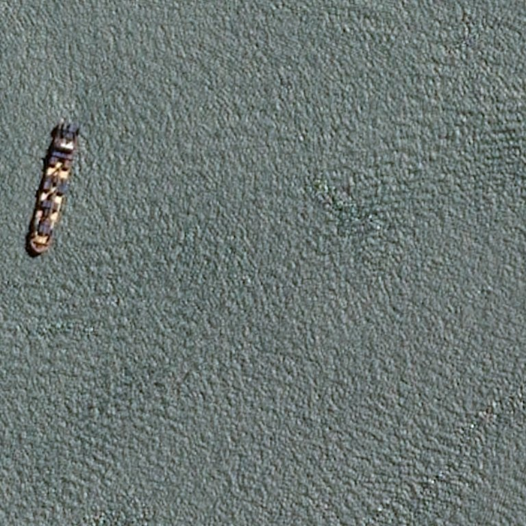
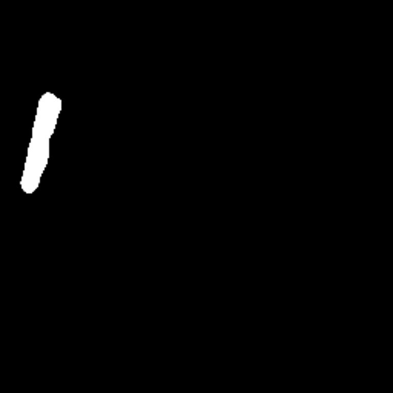
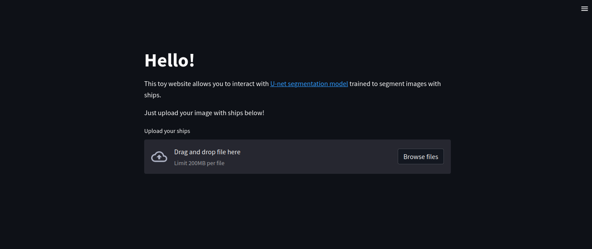

# U-netImageSegmentation

This project allows you to segment ships on a [satellite images](https://www.kaggle.com/competitions/airbus-ship-detection). The data was processed and cleared. The U-net architecture used to build a neural net for image segmentation. This neural net was trained on a big dataset and achieved good IoU and dice scores. The result can be better if you have much more computational power.

## Description

`ShipsSegmentation.ipynb` contains all data loading and preprocessing steps, EDA, building a neural net, evaluating peromance, etc.
`model.py` defines U-net.
`train.py` contains code to train the model on **cpu** (using tensorflow-cpu package to reduce slug size).
`inference.py` contains code to inference the model.
`main.py` contains code to make a toy streamlit web application to deal with the model.

## Install and run

You can just clone this repository, install all requirements from `requirements.txt` and run a command `python3 inference.py -i input.jpg -o output.jpg` to segment an image with ships. Or you can run a web application using the command `streamlit run main.py`

Or you can copy the `Dockerfile` and build an image with streamlit application or just pull it from a dockerhub using the command `docker pull santoniothefirst/unet_segmentation:latest`. Then just run `docker run --rm -p 8501:8501 --name unet santoniothefirst/unet_segmentation:latest`.

